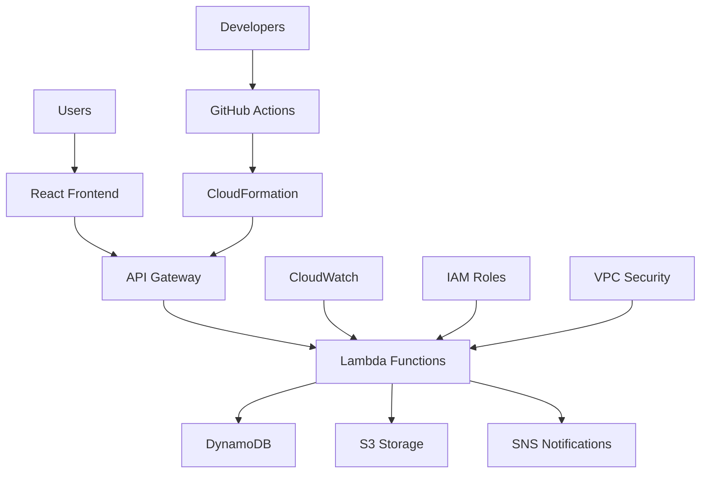

# ServerlessHub

A complete serverless platform simulating Google Cloud Platform services, built with modern web technologies and AWS infrastructure. This project demonstrates enterprise-grade serverless architecture with comprehensive functionality for managing cloud functions, API endpoints, databases, logging, and security.


## 🚀 Features

### Core Platform Services
- **User Authentication** - JWT-based secure authentication with bcrypt password hashing
- **Cloud Functions Management** - Deploy, test, and manage serverless functions
- **API Gateway Integration** - RESTful API with comprehensive endpoint management
- **Data Processing Pipeline** - Automated S3-triggered data processing workflows
- **Database Operations** - Full CRUD operations with DynamoDB integration
- **Real-time Logging** - CloudWatch integration with filtering and monitoring
- **IAM & Security** - Role-based access control and security policy management

### Technical Highlights
- **Serverless Architecture** - 100% serverless using AWS Lambda, API Gateway, and DynamoDB
- **Modern Frontend** - React 18 with TypeScript and Tailwind CSS
- **Professional UI** - Google Cloud Platform-inspired design system
- **Infrastructure as Code** - Complete CloudFormation templates
- **Monitoring & Alerts** - CloudWatch dashboards and automated alerting
- **CI/CD Ready** - GitHub Actions workflow templates included

## 🎯 Live Demo

**Dashboard Interface**: [View Live Demo]( https://reaishma.github.io/ServerlessHub/)

**API Documentation**: [OpenAPI Specification](https://github.com/Reaishma/ServerlessHub/blob/main/serverless%20-config/api-gateway/api-gateway.yaml )


## 🏗️ Architecture



### Technology Stack

#### Frontend
- **React 18** - Modern React with hooks and concurrent features
- **TypeScript** - Type-safe development
- **Tailwind CSS** - Utility-first CSS framework
- **Wouter** - Lightweight routing
- **TanStack Query** - Server state management
- **React Hook Form** - Form handling with validation

#### Backend & Infrastructure
- **AWS Lambda** - Serverless compute functions
- **API Gateway** - RESTful API management
- **DynamoDB** - NoSQL database
- **S3** - Object storage and static hosting
- **CloudWatch** - Monitoring and logging
- **SNS** - Notification services
- **CloudFormation** - Infrastructure as Code

#### Development Tools
- **Vite** - Fast build tool and development server
- **ESLint** - Code linting and quality
- **Jest** - Unit testing framework
- **GitHub Actions** - CI/CD pipeline
- **SAM CLI** - Serverless application deployment

## 🚀 Quick Start

### Prerequisites

- **Node.js 18+** and npm
- **AWS CLI** configured with appropriate permissions
- **SAM CLI** for serverless deployment
- **Git** for version control

### Installation

1. **Clone the repository**
   ```bash
   git clone https://github.com/Reaishma/serverless-platform
   cd serverless-platform
   ```

2. **Install dependencies**
   ```bash
   npm install
   ```

3. **Start development server**
   ```bash
   npm run dev
   ```

4. **View the application**
   Open [http://localhost:5000](http://localhost:5000) in your browser

### AWS Deployment

1. **Deploy infrastructure**
   ```bash
   cd serverless-config
   npm run setup
   npm run deploy:guided
   ```

2. **Configure environment**
   ```bash
   # Set your notification email
   export NOTIFICATION_EMAIL=your-email@example.com
   
   # Deploy with custom parameters
   npm run deploy:dev
   ```

3. **Verify deployment**
   ```bash
   npm run test:integration
   ```

## 📁 Project Structure

```
serverless-platform/
├── client/                          # React frontend application
│   ├── src/
│   │   ├── components/             # Reusable UI components
│   │   ├── pages/                  # Application pages
│   │   ├── hooks/                  # Custom React hooks
│   │   └── lib/                    # Utility libraries
│   └── index.html                  # Main HTML template
├── server/                         # Express.js backend (development)
│   ├── index.ts                    # Server entry point
│   ├── routes.ts                   # API route definitions
│   └── storage.ts                  # Data storage layer
├── shared/                         # Shared TypeScript definitions
│   └── schema.ts                   # Database schema and types
├── serverless-config/              # AWS serverless infrastructure
│   ├── lambda-functions/           # Lambda function source code
│   │   ├── user-authentication/    # JWT authentication service
│   │   ├── data-processor/         # S3 event processing
│   │   └── api-handler/            # REST API handler
│   ├── api-gateway/                # API Gateway configuration
│   ├── cloudformation/             # CloudFormation templates
│   └── README.md                   # Deployment documentation
├── html-version/                   # Standalone HTML/CSS/JS version
└── docs/                          # Additional documentation
```

## 🛠️ Development

### Local Development

```bash
# Start the development server
npm run dev

# Run tests
npm test

# Lint code
npm run lint

# Type check
npm run type-check
```

### Environment Configuration

Create a `.env` file for local development:

```env
NODE_ENV=development
JWT_SECRET=your-jwt-secret-key
DATABASE_URL=your-database-url
AWS_REGION=us-east-1
```

### Adding New Features

1. **Create feature branch**
   ```bash
   git checkout -b feature/new-feature
   ```

2. **Implement changes**
   - Add components in `client/src/components/`
   - Add API routes in `server/routes.ts`
   - Update types in `shared/schema.ts`

3. **Test thoroughly**
   ```bash
   npm test
   npm run test:e2e
   ```

4. **Submit pull request**

## 📚 API Documentation

### Authentication

#### POST /auth/login
Authenticate user and receive JWT token
```json
{
  "email": "user@example.com",
  "password": "securePassword123"
}
```

#### POST /auth/register
Create new user account
```json
{
  "email": "user@example.com",
  "password": "securePassword123",
  "name": "John Doe",
  "role": "user"
}
```

### Cloud Functions

#### GET /api/functions
List all deployed functions
```bash
curl -H "Authorization: Bearer <token>" \
  https://api.example.com/api/functions
```

#### POST /api/functions
Deploy new function
```json
{
  "name": "my-function",
  "runtime": "Node.js 18",
  "trigger": "HTTP",
  "code": "exports.handler = async (event) => { return 'Hello World'; }"
}
```

### Data Processing

#### POST /api/endpoints/test
Test external API endpoint
```json
{
  "method": "GET",
  "url": "https://api.external.com/data",
  "headers": "Authorization: Bearer token",
  "body": ""
}
```

For complete API documentation, see [OpenAPI Specification](  serverless -config/api-gateway/api-gateway.yaml.)

## 🔒 Security

### Authentication & Authorization
- **JWT Tokens** with 24-hour expiration
- **bcrypt Password Hashing** with 12 rounds
- **Role-based Access Control** (RBAC)
- **API Rate Limiting** via AWS API Gateway

### Data Protection
- **Encryption at Rest** for DynamoDB tables
- **HTTPS Only** communication
- **CORS Configuration** for secure cross-origin requests
- **Input Validation** on all endpoints

### Infrastructure Security
- **IAM Least Privilege** access policies
- **VPC Isolation** for production environments
- **AWS WAF** integration available
- **CloudTrail Audit** logging enabled

## 📊 Monitoring & Analytics

### Real-time Metrics
- **API Response Times** and error rates
- **Lambda Function Performance** and cold starts
- **Database Query Performance** and throttling
- **System Resource Usage** (CPU, memory, storage)

### Alerting
- **Error Rate Thresholds** with SNS notifications
- **Performance Degradation** alerts
- **Security Event** monitoring
- **Custom Business Metrics** tracking

### Dashboards
- **CloudWatch Dashboards** for infrastructure metrics
- **Application Performance** monitoring
- **User Analytics** and behavior tracking
- **Cost Optimization** insights

## 🔄 CI/CD Pipeline

### GitHub Actions Workflow

```yaml
name: Deploy Serverless Platform
on:
  push:
    branches: [main, develop]
  pull_request:
    branches: [main]

jobs:
  test:
    runs-on: ubuntu-latest
    steps:
      - uses: actions/checkout@v3
      - uses: actions/setup-node@v3
      - run: npm ci
      - run: npm test
      - run: npm run lint

  deploy:
    needs: test
    runs-on: ubuntu-latest
    if: github.ref == 'refs/heads/main'
    steps:
      - uses: actions/checkout@v3
      - uses: aws-actions/setup-sam@v2
      - run: sam build
      - run: sam deploy --no-confirm-changeset
```

### Deployment Environments
- **Development** - Automatic deployment on feature branches
- **Staging** - Manual approval for release candidates
- **Production** - Blue/green deployment with rollback capability

## 🧪 Testing

### Test Coverage
- **Unit Tests** - 85%+ coverage for critical components
- **Integration Tests** - API endpoint validation
- **End-to-End Tests** - User workflow verification
- **Performance Tests** - Load testing with Artillery

### Running Tests

```bash
# Unit tests
npm test

# Integration tests
npm run test:integration

# E2E tests
npm run test:e2e

# Performance tests
npm run test:performance

# Coverage report
npm run test:coverage
```

## 🚀 Deployment Options

### Development Deployment
```bash
# Quick development deployment
npm run deploy:dev
```

### Production Deployment
```bash
# Production with all optimizations
npm run deploy:prod
```

### Multi-Region Deployment
```bash
# Deploy to multiple AWS regions
npm run deploy:multi-region
```

### Containerized Deployment
```bash
# Deploy using Docker containers
npm run deploy:container
```

## 📈 Performance

### Benchmarks
- **API Response Time**: < 200ms average
- **Function Cold Start**: < 1000ms
- **Database Queries**: < 100ms average
- **File Processing**: 1MB/second throughput

### Optimization Features
- **Connection Pooling** for database efficiency
- **Lambda Provisioned Concurrency** for consistent performance
- **API Gateway Caching** for repeated requests
- **CDN Integration** for static assets

## 🤝 Contributing

We welcome contributions!


### Development Process
1. Fork the repository
2. Create a feature branch
3. Make your changes
4. Add tests for new functionality
5. Ensure all tests pass
6. Submit a pull request

### Code Standards
- **ESLint** configuration provided
- **Prettier** for code formatting
- **Conventional Commits** for commit messages
- **TypeScript** for type safety

## 📄 License

This project is licensed under the MIT License - see the [LICENSE]( https://github.com/Reaishma/ServerlessHub/blob/main/LICENSE) file for details.

## 🙏 Acknowledgments

- **AWS** for providing excellent serverless services
- **React Team** for the amazing frontend framework
- **Google Cloud Platform** for UI/UX inspiration
- **Open Source Community** for the incredible tools and libraries

## 👨‍💻 Developer

**Reaishma N**
- **Email**: vra.9618@gmail.com
- **GitHub**: [@Reaishma](https://github.com/Reaishma)


## 📞 Support

- For support and questions:
- Create an issue in the repository
- Review configuration examples in `/config`
- **Email**: vra.9618@gmail.com

## Roadmap

**Upcomingg featurese**
- [ ] **GraphQL API** integration
- [ ] **Real-time WebSocket** connections
- [ ] **Machine Learning** integration with AWS SageMaker
- [ ] **Multi-tenant** architecture support
- [ ] **Mobile App** with React Native
- [ ] **Advanced Analytics** dashboard
- [ ] **Kubernetes** deployment option
- [ ] **International** localization support

### Version History
- **v1.0.0** - Initial release with core functionality
- **v1.1.0** - Added real-time monitoring and alerts
- **v1.2.0** - Enhanced security and performance optimizations
- **v2.0.0** - Complete UI redesign and new features (planned)

---

**⭐ Star this repository if you find it helpful!**

*Built with ❤️ by Reaishma N - Demonstrating modern serverless architecture and cloud platform development*
